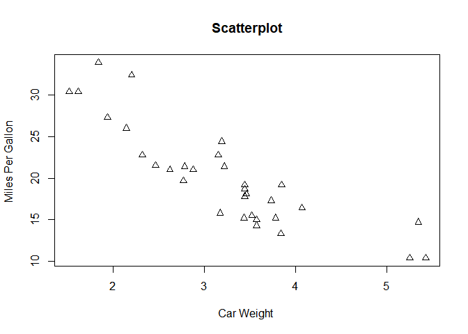
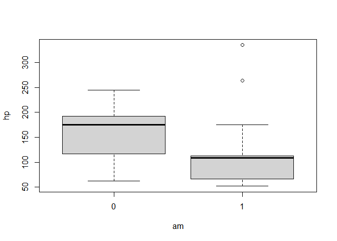
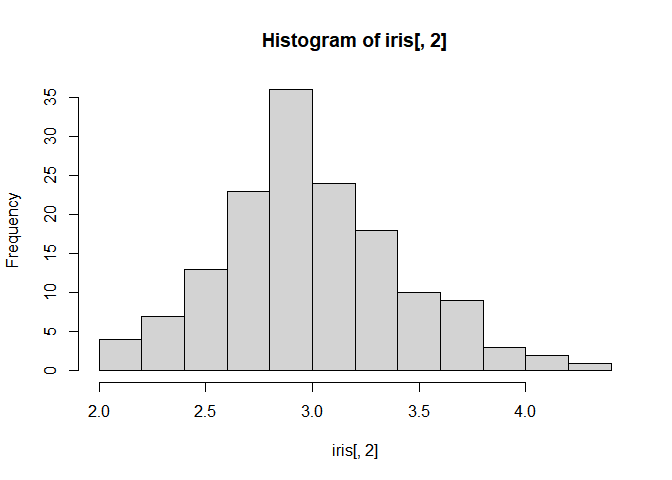

Individual work 2
================

``` r
knitr::opts_chunk$set(echo = TRUE)
```

# Questions:

1.  What function would you use to show the directory on your computer
    that R is using as its working directory?

``` r
 getwd()
```

    ## [1] "c:/Users/cdera/OneDrive/MBA/S4 - BI/scripts/Ind2"

2.  What function would you use to list all the variables (“objects”)
    that are defined in your R workspace? `objects()` does it

``` r
 objects()
```

    ## character(0)

`ls()` does the same

``` r
 ls()
```

    ## character(0)

3.  What function would you use to set your R working directory to a
    different directory?

<!-- -->

        setwd('path')

4.  Write out an R function to create a vector that consists of the
    integers 1-5 repeated 50 times: 1,2,3,4,5,1,2,3,4,5,1,2,3,4,5 , …
    first the function:

``` r
l1 <- function(a, b, n=50) {
    x <- rep(seq(a, b), n)
    return(x)
}
```

now let’s see if it works

``` r
    a <- l1(1, 5, 20)
    b <-l1(1, 10)
    print(a)
```

    ##   [1] 1 2 3 4 5 1 2 3 4 5 1 2 3 4 5 1 2 3 4 5 1 2 3 4 5 1 2 3 4 5 1 2 3 4 5 1 2
    ##  [38] 3 4 5 1 2 3 4 5 1 2 3 4 5 1 2 3 4 5 1 2 3 4 5 1 2 3 4 5 1 2 3 4 5 1 2 3 4
    ##  [75] 5 1 2 3 4 5 1 2 3 4 5 1 2 3 4 5 1 2 3 4 5 1 2 3 4 5

``` r
    print(b)
```

    ##   [1]  1  2  3  4  5  6  7  8  9 10  1  2  3  4  5  6  7  8  9 10  1  2  3  4  5
    ##  [26]  6  7  8  9 10  1  2  3  4  5  6  7  8  9 10  1  2  3  4  5  6  7  8  9 10
    ##  [51]  1  2  3  4  5  6  7  8  9 10  1  2  3  4  5  6  7  8  9 10  1  2  3  4  5
    ##  [76]  6  7  8  9 10  1  2  3  4  5  6  7  8  9 10  1  2  3  4  5  6  7  8  9 10
    ## [101]  1  2  3  4  5  6  7  8  9 10  1  2  3  4  5  6  7  8  9 10  1  2  3  4  5
    ## [126]  6  7  8  9 10  1  2  3  4  5  6  7  8  9 10  1  2  3  4  5  6  7  8  9 10
    ## [151]  1  2  3  4  5  6  7  8  9 10  1  2  3  4  5  6  7  8  9 10  1  2  3  4  5
    ## [176]  6  7  8  9 10  1  2  3  4  5  6  7  8  9 10  1  2  3  4  5  6  7  8  9 10
    ## [201]  1  2  3  4  5  6  7  8  9 10  1  2  3  4  5  6  7  8  9 10  1  2  3  4  5
    ## [226]  6  7  8  9 10  1  2  3  4  5  6  7  8  9 10  1  2  3  4  5  6  7  8  9 10
    ## [251]  1  2  3  4  5  6  7  8  9 10  1  2  3  4  5  6  7  8  9 10  1  2  3  4  5
    ## [276]  6  7  8  9 10  1  2  3  4  5  6  7  8  9 10  1  2  3  4  5  6  7  8  9 10
    ## [301]  1  2  3  4  5  6  7  8  9 10  1  2  3  4  5  6  7  8  9 10  1  2  3  4  5
    ## [326]  6  7  8  9 10  1  2  3  4  5  6  7  8  9 10  1  2  3  4  5  6  7  8  9 10
    ## [351]  1  2  3  4  5  6  7  8  9 10  1  2  3  4  5  6  7  8  9 10  1  2  3  4  5
    ## [376]  6  7  8  9 10  1  2  3  4  5  6  7  8  9 10  1  2  3  4  5  6  7  8  9 10
    ## [401]  1  2  3  4  5  6  7  8  9 10  1  2  3  4  5  6  7  8  9 10  1  2  3  4  5
    ## [426]  6  7  8  9 10  1  2  3  4  5  6  7  8  9 10  1  2  3  4  5  6  7  8  9 10
    ## [451]  1  2  3  4  5  6  7  8  9 10  1  2  3  4  5  6  7  8  9 10  1  2  3  4  5
    ## [476]  6  7  8  9 10  1  2  3  4  5  6  7  8  9 10  1  2  3  4  5  6  7  8  9 10

5.  What is the name of the R class that has rows and columns, and is
    the default class R uses when reading in files with functions like
    read.csv () or read.table () Dataframe

``` r
 str(iris)
```

    ## 'data.frame':    150 obs. of  5 variables:
    ##  $ Sepal.Length: num  5.1 4.9 4.7 4.6 5 5.4 4.6 5 4.4 4.9 ...
    ##  $ Sepal.Width : num  3.5 3 3.2 3.1 3.6 3.9 3.4 3.4 2.9 3.1 ...
    ##  $ Petal.Length: num  1.4 1.4 1.3 1.5 1.4 1.7 1.4 1.5 1.4 1.5 ...
    ##  $ Petal.Width : num  0.2 0.2 0.2 0.2 0.2 0.4 0.3 0.2 0.2 0.1 ...
    ##  $ Species     : Factor w/ 3 levels "setosa","versicolor",..: 1 1 1 1 1 1 1 1 1 1 ...

6.  What function would you use to see how many rows your data has?

``` r
 nrow(mtcars)
```

    ## [1] 32

7.  What function would you use to see the first several rows of your
    data?

``` r
 head(iris)
```

    ##   Sepal.Length Sepal.Width Petal.Length Petal.Width Species
    ## 1          5.1         3.5          1.4         0.2  setosa
    ## 2          4.9         3.0          1.4         0.2  setosa
    ## 3          4.7         3.2          1.3         0.2  setosa
    ## 4          4.6         3.1          1.5         0.2  setosa
    ## 5          5.0         3.6          1.4         0.2  setosa
    ## 6          5.4         3.9          1.7         0.4  setosa

8.  What does the summary () function do? delivers summary stats on the
    given variable/set

``` r
summary(cars)
```

    ##      speed           dist       
    ##  Min.   : 4.0   Min.   :  2.00  
    ##  1st Qu.:12.0   1st Qu.: 26.00  
    ##  Median :15.0   Median : 36.00  
    ##  Mean   :15.4   Mean   : 42.98  
    ##  3rd Qu.:19.0   3rd Qu.: 56.00  
    ##  Max.   :25.0   Max.   :120.00

9.  What does the str () function do? delivers structure of the variable

``` r
str(cars)
```

    ## 'data.frame':    50 obs. of  2 variables:
    ##  $ speed: num  4 4 7 7 8 9 10 10 10 11 ...
    ##  $ dist : num  2 10 4 22 16 10 18 26 34 17 ...

10. What base graphics functions is used to create a scatterplot? plot
    <!-- -->
11. What parameters would you use to label the x and y axes of a
    graphics plot? Copy and paste into your document the scatterplot
    produced from the cars data that plots the points as triangles (You
    can copy and paste as bitmap or metafile directly from the R
    graphics window)

``` r
attach(mtcars)
plot(wt, mpg, main="Scatterplot",
   xlab="Car Weight ", ylab="Miles Per Gallon ", pch=24)
```

<!-- --> 12. What function
would you use to create a boxplot?

``` r
    boxplot(hp ~ am, data = mtcars)
```

<!-- --> 13. What
function would you use to create a histogram?

``` r
    hist(iris[,2])
```

<!-- --> 14. What is the
URL for the recommended web page to use to explore other elements of
base graphics?
<https://compgenomr.github.io/book/plotting-in-r-with-base-graphics.html>

though for real `ggplot2` is just the best there is:
<https://r-graph-gallery.com/ggplot2-package.html>
